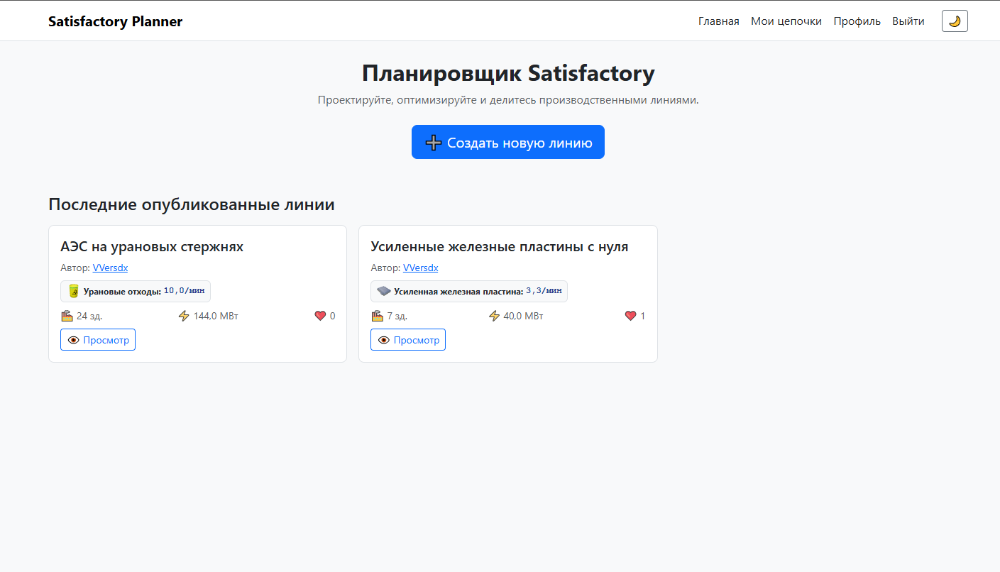
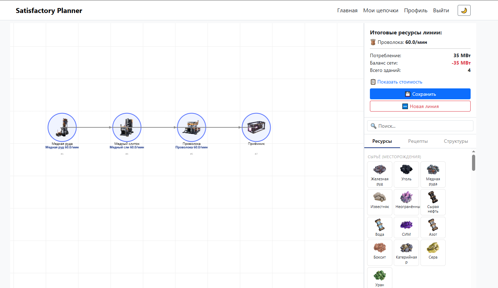
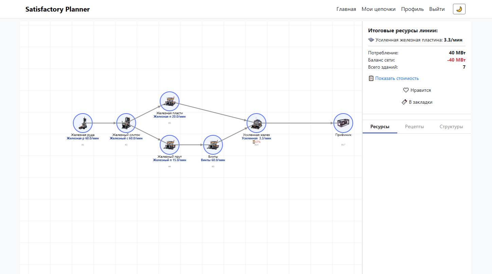

# Satisfactory Planner

Веб-сервис для проектирования, расчёта и публикации производственных линий игры Satisfactory. Помогает игрокам планировать заводы: визуально строить схемы на сетке, автоматически рассчитывать материальные потоки и энергопотребление, сохранять пресеты и делиться ими с сообществом.

**Ключевые возможности:**
- Визуальное построение линий на Canvas с соединениями (конвейеры, трубы)
- Автоматический расчёт с учётом недозагрузки, разгона и петлевиков
- Пропорциональное распределение ресурсов по потребностям downstream-зданий
- Сохранение, публикация, просмотр и копирование пресетов
- Лайки, закладки, профили авторов
- Тёмная тема и тултипы при наведении

---

## Стек технологий

| Компонент        | Технология                                                                                   |
|:-----------------|:---------------------------------------------------------------------------------------------|
| Backend          | Python 3.12, Django 5.0                                                                      |
| База данных      | SQLite (разработка), PostgreSQL (production)                                                 |
| Алгоритм расчёта | Собственная реализация на Python (топологическая сортировка, пропорциональное распределение) |
| Frontend         | HTML5 Canvas, Bootstrap 5.3, Vanilla JavaScript                                              |
| Деплой           | PythonAnywhere                                                                               |

---

## Скриншоты

### Главная страница
*Лента опубликованных линий с карточками (название, автор, итоговые ресурсы, энергобаланс, лайки)*



### Построение линии
*Поле с сеткой, панель инструментов, отображение результатов расчёта под каждым зданием*



### Просмотр линии
*Read-only режим с итоговыми ресурсами и кнопками лайка/закладок*



### Тёмная тема
*Адаптивная тёмная тема с автоматическим переключением цветов Canvas*


---

## Архитектура проекта

```

satisfactory-planner/
├── config/                 # Django project settings
│   ├── settings.py
│   ├── urls.py
│   └── wsgi.py
├── planner/                # Основное приложение
│   ├── models.py           # 16 моделей (Item, Building, Recipe, ...)
│   ├── views/              # Представления (home, builder, api, auth)
│   ├── services/           # Бизнес-логика
│   │   ├── calculator.py   # Расчёт линии (Django ORM)
│   │   ├── preview_calculator.py  # Расчёт без БД (для preview)
│   │   ├── topology.py     # Топологическая сортировка
│   │   ├── validators.py   # Валидация соединений
│   │   └── constants.py    # Игровые константы
│   ├── fixtures/           # Фикстуры с игровыми данными
│   ├── management/         # Кастомные команды Django
│   └── forms.py            # Формы регистрации и профиля
├── templates/              # HTML-шаблоны
│   ├── base.html           # Базовый шаблон с навбаром
│   ├── registration/       # Логин и регистрация
│   └── planner/            # Шаблоны приложения
├── static/                 # CSS, JS
├── media/                  # Загружаемые иконки предметов и зданий
├── parse_recipes.py        # Парсер ru.json → фикстура Django
├── attach_icons.py         # Привязка иконок к предметам
├── TZ.md                   # Техническое задание
└── manage.py

```

---

## Как запустить проект локально

### 1. Клонируйте репозиторий
```bash
git clone https://github.com/vversdx/satisfactory-planner.git
cd satisfactory-planner
```

### 2. Создайте и активируйте виртуальное окружение

```
python -m venv .venv

# Windows:
.venv\Scripts\activate

# Linux/Mac:
source .venv/bin/activate
```

### 3. Установите зависимости

```
pip install -r requirements.txt
```

### 4. Выполните миграции

```
python manage.py makemigrations
python manage.py migrate
```

### 5. Создайте суперпользователя

```
python manage.py createsuperuser
```

### 6. Загрузите игровые данные

**Вариант А — из готовой фикстуры:**

```
python manage.py loaddata initial_data
```

**Вариант Б — сгенерировать из файла игры:**

1. Скопируйте `ru.json` из папки игры Satisfactory в корень проекта.
1. Запустите парсер:

```
python parse_recipes.py Docs.json
```
1. Создайте здания в админке (Конструктор, Плавильня, Сборщик и т.д.).
1. Привяжите названия зданий к PK:

```
python update_fixture.py
```
1. Загрузите фикстуру:

```
python manage.py loaddata initial_data
```

### 7. (Опционально) Привяжите иконки

Скачайте иконки из [SatisfactoryTools](https://github.com/greeny/SatisfactoryTools) и запустите:

```
python attach_icons.py "путь/к/папке/с/иконками"
```

### 8. Запустите сервер

```
python manage.py runserver
```

Откройте [http://127.0.0.1:8000/](http://127.0.0.1:8000/) в браузере.

## Ссылка на деплой

**[https://ваш-username.pythonanywhere.com](https://%D0%B2%D0%B0%D1%88-username.pythonanywhere.com)**

## Лицензия

MIT

